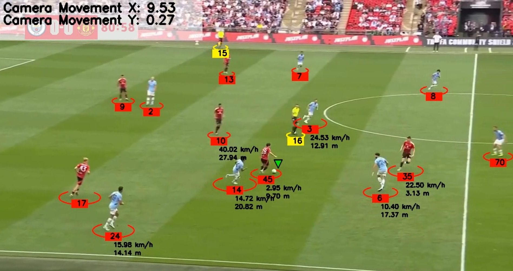

# ⚽ Football Player Tracking & Analysis

This project combines **YOLOv11**, **ByteTrack**, and **BoT-SORT (with ReID)** to detect, track, and analyze players and the ball in football match videos. It also performs real-world speed & distance estimation, 2D pitch mapping, and final video annotation.

🎬 

---

## 📌 Table of Contents

- [Overview](#overview)
- [Project Features](#project-features)
- [Requirements](#requirements)
- [Installation](#installation)
- [Usage](#usage)
- [Modules](#modules)
- [Future Improvements](#future-improvements)
- [Acknowledgments](#acknowledgments)

---

## 🧠 Overview

This football analysis project focuses on:

1. **Detection & Tracking**:
   - Player & ball detection using YOLOv5
   - Player Re-identification using BoT-SORT with ReID
   - Additional Add on ByteTracker is given as alternate tracker
   - Tracking players across frames using BoT-SORT
   - Ball position interpolation when missing

2. **Camera Movement Estimation**:
   - Calculates camera shifts using optical flow
   - Stabilizes player coordinates relative to the ground

3. **Perspective Transformation**:
   - Projects player positions onto a top-down 2D pitch using homography

4. **Speed & Distance Analysis**:
   - Calculates speed (km/h) and cumulative distance (meters) per player

---

## 🚀 Project Features

- ✅ YOLOv8 player, ball, and referee detection
- 🔄 ByteTrack and BoT-SORT tracking options
- 🎥 Camera movement correction
- 🔁 ReID-based player re-identification
- 🗺️ 2D pitch coordinate transformation
- 🏃 Speed & distance annotations
- 🧠 Modular architecture (easy to extend/plug-in models)
- 💾 Caching for faster re-runs

---
## Installation

To install and set up the project, follow these steps:

1. **Clone the Repository**: Clone this repository to your local machine using the following command:
   ```bash
   git clone https://github.com/your-username/football-analysis.git
   ```

2. **Setup Environment**: Set up the environment by creating a new Python environment and activating it:
    ```bash
    conda create -n YOLO python=3.8
    conda activate YOLO
    ```
3. **Download Pre-trained Weights**: Download the pre-trained weights for YOLOv8X from the following link: [here](https://drive.google.com/file/d/1-5fOSHOSB9UXyP_enOoZNAMScrePVcMD/view) and place it inside the **Models** folder

4. **Install Required Libraries**: Install the required libraries using pip:
    ```bash
    pip install -r requirements.txt
    ```
---
## Usage
1.After installing the dependencies and setting up your models and inputs, you can run the pipeline using:
```bash
python main.py
```
This will run the entire pipeline, including player detection, tracking, camera movement correction, and speed &
distance analysis.

**🔁 Switching Between Trackers**
To switch between ByteTrack and BoT-SORT, modify the **tracker_name** variable in the *main.py*
```bash
tracks = tracker.object_tracker(
    tracker_name="botSORT",   # Options: "botSORT", "byteTRACK"
    frames=video_frames,
    confidence_threshold=0.7,
    read_from_cache=False,
    cache_path="./caches/your_cache.pkl"
)
```

**📥 Input Video**
Place your input videos inside the inputs/ folder. For example:
```
inputs/
└── 15sec_input_720p.mp4
```
Modify main.py to point to your specific video file:
```
video_frames = read_video("./inputs/15sec_input_720p.mp4")
```

**🧠 Caching System**
The system uses caching to improve performance by avoiding redundant computation of expensive operations like tracking or camera motion estimation.

You can enable or disable caching for each component by setting:
```bash
read_from_cache=False  # Set to True to reuse previous computation
cache_path="./caches/your_cache.pkl"  # Path to cache file
```
This applies to:
- Player tracking
- Camera movement estimation

If **read_from_cache=True** and the cache file exists, it will load from disk instead of recalculating.

**🎯 Output**
The system outputs the following files:
```
outputs/
└── tracked_fnl4.mp4
```
You can change the output path in the last line of main.py:
```
save_video(output_frames=output_video_frames, output_path="./outputs/tracked_fnl4.mp4")
```
---


## 🧩 Modules

This project is designed with modularity and clarity in mind. Each core functionality is encapsulated in a separate Python module:

### 🔍 `tracker.py`
- Initializes object detection using **YOLOv8**.
- Supports two tracking algorithms: **BoT-SORT** and **ByteTrack**.
- Adds foot-level position information to each player's bounding box.
- Draws player annotations (ID, team, bounding box) on video frames.

### 🎥 `camera_movement_estimator.py`
- Estimates inter-frame **camera motion** using feature matching and homography.
- Smooths out motion to ensure consistent positional tracking despite camera shakes or pans.
- Adjusts player positions accordingly to remove camera-induced movement drift.

### 🗺️ `view_transformer.py`
- Projects player positions from image space to **2D pitch coordinates** using a **homography matrix**.
- Ensures consistent spatial mapping regardless of camera angle or zoom.
- Enables accurate distance and speed calculations.

### 🏃 `speed_and_distance_estimator.py`
- Calculates **per-player speed** and **total distance covered** using transformed pitch coordinates.
- Aggregates data over multiple frames and assigns metrics per timestamp.
- Draws speed and distance information on each frame near the player.

### 🧠 `main.py`
- Entry point to run the full pipeline.
- Handles directory creation, reads input video, executes detection, tracking, transformation, and annotation.
- Saves final processed output video with all overlays.

### 🛠️ `utils.py`
- Contains helper functions for:
  - Video I/O (`read_video`, `save_video`)
  - Drawing utilities (`visual_frames`)
  - Mathematical helpers (`measure_distance`, `get_foot_position`)
  - Folder management (`make_directories`)

### 📁 `caches/`
- Stores `.pkl` cache files for:
  - Tracking results
  - Camera motion vectors
- Used to skip redundant processing on reruns.

### 📂 `models/`
- Stores YOLOv8 and Re-ID model weights.
- Add your custom or pre-trained model files here.
---
## 🚀 Future Improvements

Here are a few enhancements planned to elevate the accuracy, efficiency, and feature richness of this project:

### 📌 Multi-Camera Player Re-identification
- Extend the pipeline to support **multi-angle match videos** with consistent player identity mapping across views using advanced **Re-ID models**.

### 📊 Player Heatmaps and Zone Tracking
- Generate **heatmaps** for each player over time to analyze movement density and positioning.
- Detect and visualize player zones (defensive, midfield, attacking).

### 🤝 Pass and Possession Analysis
- Integrate pass detection to quantify **successful passes**, pass networks, and **team possession heatmaps**.

### 🧠 Deep Re-Identification
- Replace manual Re-ID with **transformer-based embeddings** (e.g., OSNet, FastReID) for robust identity retention even in occlusion or camera transitions.

### ⚽ Ball Trajectory and Shot Detection
- Analyze **ball path curvature** and speed.
- Detect potential shots, goals, and assists using ball-player interaction.

### ⏱️ Real-Time Inference
- Optimize pipeline to support **real-time analysis** using threading and GPU acceleration for match-day deployment.

---
## Acknowledgments

- **YouTube Tutorial by (Code In a Jiffy)**: [Link](https://www.youtube.com/watch?v=neBZ6huolkg&ab_channel=CodeInaJiffy)
- **Dataset**: [link](https://universe.roboflow.com/roboflow-jvuqo/football-players-detection-3zvbc/dataset/1)
- **medium article color clustering**: [link](https://medium.com/analytics-vidhya/color-separation-in-an-image-using-kmeans-clustering-using-python-f994fa398454)

---


